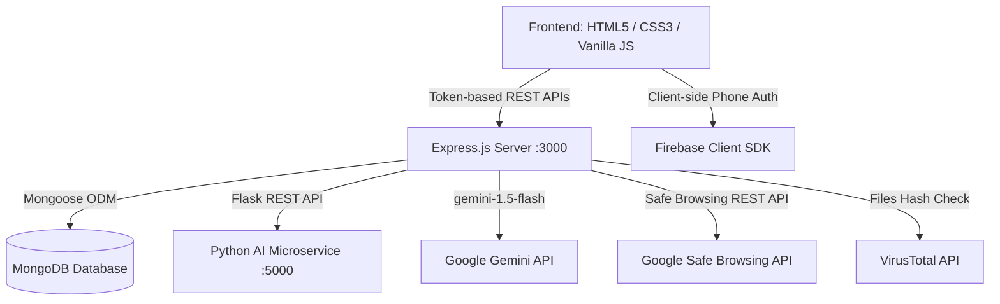
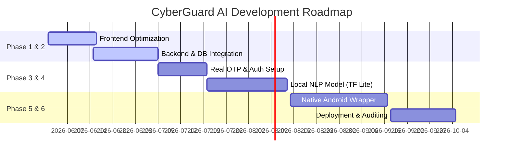

# CyberGuard AI: Mobile Security & Threat Intelligence Platform
## Technical Architecture, Implementation Report & Presentation Guide

---

> [!NOTE]
> This document serves as a comprehensive guide for students, developers, project guides, and interviewers to understand the CyberGuard AI architecture, current implementation state, planned capabilities, and project pitch.

---

## 1. What CyberGuard AI Is

### Problem Statement
Modern mobile security threats have evolved beyond simple signature-based file malware. Today, the most devastating mobile attacks leverage **social engineering, credential phishing, and manipulative SMS messages (smishing)**. Traditional antivirus solutions fail to prevent these because:
- They scan the file system but ignore the context of communications.
- Users are presented with complex, scary alerts that they don't understand, causing them to click through warnings.
- Malicious applications exploit legitimate permissions (like SMS access, Location, or Contacts) to harvest data without triggering typical virus signatures.

### The CyberGuard AI Solution
**CyberGuard AI** is a smart mobile threat intelligence platform designed to bridge the gap between technical detection and human understanding. It doesn't just block threats; it **explains them in simple, clear language**.
By leveraging heuristic scanning and planned Artificial Intelligence, it reviews device safety through:
1. **Context-aware SMS parsing** to detect phishing, social engineering, and OTP theft.
2. **Real-time URL reputation checks** to prevent credential harvesting.
3. **App Permission auditing** to detect dangerous combinations of accesses.
4. **An Interactive AI Security Agent** powered by large language models to answer user questions, explain threats, and provide step-by-step resolution playbooks.

### Target Audience & Users
- **Everyday Mobile Users**: Non-technical individuals who require clear, non-jargon explanations and actionable safety recommendations when an anomaly is detected.
- **Enterprise Employees**: Remote workers who access company data on personal mobile devices (BYOD - Bring Your Own Device), where a single phishing SMS could compromise the corporate network.
- **Elderly and Tech-Vulnerable Demographics**: Individuals frequently targeted by banking fraud, lottery scams, and urgent verification frauds.

### Why It Is Needed
With mobile banking fraud rising by over 40% year-over-year globally, the phone is the primary vector of identity theft. CyberGuard AI acts as an **active digital bodyguard** that not only monitors device signals but actively educates the user, making them the strongest link in their own security chain rather than the weakest.

---

## 2. Technical Stack & Technologies Used

The current project is built as a fully functional full-stack hybrid prototype, leveraging modern web standards, lightweight backend APIs, and AI integrations:



### Core Technologies
- **HTML5 (Structure)**: Native semantic page layouts separating public pages (Landing page, Features, Support, Tips) from secure app pages (Dashboard, Scan, Alerts, AI Agent, Settings, Profile).
- **Vanilla CSS3 (Premium Aesthetics)**: Customized design system using standard CSS variables (`:root`). It incorporates a dark-themed, glassmorphic layout, vibrant gradient accents, micro-animations (`@keyframes`), and custom utility classes.
- **Vanilla JavaScript (ES6+ - Client Logic)**: Client-side routing, DOM manipulation, storage event handling, security score animations, and fetch-based integrations.
- **Web Storage (`localStorage` & `sessionStorage`)**:
  - `localStorage` stores the session status (`isLoggedIn: true`) and the JWT token (`cyberguard_token`) to maintain user authentication across page refreshes.
  - `sessionStorage` temporarily holds pending signup data and Firebase `verificationId` during the OTP verification flow.

### Backend & Databases
- **Node.js & Express.js (Core Backend)**: Handles core REST APIs, rate limiting (`express-rate-limit`), security headers (`helmet`), cross-origin sharing (`cors`), file upload parsing (`multer`), and session generation with JSON Web Tokens (`jsonwebtoken`).
- **MongoDB & Mongoose (Database & ODM)**: Stores user credentials, active security alerts, history of runs, user settings, support tickets, and chat history.
- **Python Flask (AI/ML Microservice)**: A secondary microservice that simulates local ML message classification using linguistic tokenizers and pattern matching algorithms.

### Integrations & Libraries
- **Firebase Auth (Client-side)**: Used in the signup flow (`auth.js`) for reCAPTCHA validation and mobile-side phone/OTP challenges.
- **Google Gemini API (`@google/generative-ai`)**: Powers the backend agent (`routes/agent.js`) using `gemini-1.5-flash` to process conversational security queries with system prompts.
- **Google Safe Browsing API**: Used in the URL checker to check suspicious links against Google's global malware and phishing registry.
- **VirusTotal API**: Used in the file-upload scanner to query file hash signatures against 70+ antivirus engines.
- **Socket.io (WebSocket)**: Integrated on the backend server for future real-time threat-event streams.
- **FontAwesome 6.4.0 (Icons)**: Powers all visual indicators, badges, and menu icons.

---

## 3. How the Website / Application Works

The user journey is designed to replicate a high-end mobile security application:

### Step 1: User Opens the Website
- The user lands on `index.html` (or `home.html` if already authenticated). The landing page features dynamic elements such as a "live protection active" badge, a real-time counter of blocked threats, problem/solution cards, and an interactive chat preview showing the AI agent in action.

### Step 2: Signup, Login, and OTP Flow
1. **Signup (`signup.html`)**: The user enters their name, phone number (with country code), email, and password. 
2. **OTP Challenge (`otp.html`)**: Clicking "Sign Up" triggers a Firebase Invisible reCAPTCHA. The Firebase Client SDK sends an OTP SMS to the user's phone. The browser redirects the user to the OTP page.
3. **OTP Verification**: The user inputs the 6-digit OTP code. The Firebase SDK validates it.
4. **Backend Registration**: On success, the client sends the user details to the Node.js backend (`/api/auth/signup`). The backend hashes the password using `bcrypt`, stores the user in MongoDB, generates a JWT token, and logs the user in.
5. **Login (`login.html`)**: For returning users, they enter their email and password, which the backend verifies using `bcrypt.compare()`, returning a fresh JWT token.

### Step 3: Permissions Welcome Screen (`permissions.html`)
- Upon first login, users are presented with a premium permission consent screen mimicking a mobile app onboarding. They grant simulated access to SMS, location, storage, and notifications to initialize their baseline security scanning.

### Step 4: The Dashboard (`dashboard.html`)
- After authentication, the user is redirected to the Dashboard. It fetches user metrics dynamically from `/api/dashboard`, showing:
  - **Overall Device Safety Score**: A gauge from 0 to 100 indicating health.
  - **Metrics**: Count of suspicious messages, risky links, and permission warnings.
  - **Live Timeline**: A feed of the 4 most recent security events with color-coded risk levels.

### Step 5: The Scan System (`scan.html`)
- Users can choose from multiple scan types: **Full Scan**, **Quick Scan**, **SMS Scan**, or **App Permission Audit**.
- Clicking **Start Scan** fires a progress engine, updating step-by-step logs in a simulated terminal console.
- **Real Workspace scan**: The backend actually scans the server's workspace directory, searching for hardcoded API keys/secrets, unsafe functions (like `eval()` or `exec()`), and executable scripts.
- **Real URL Checker**: Users can paste any link into the URL input. The client hits `/api/scan_v2/url`, which runs a regex-keyword checker and queries the Google Safe Browsing API, reporting if the link is safe, warning-level, or critical danger.

### Step 6: Alerts Page (`alerts.html`)
- Displays all historical and active threats categorized by risk: Critical (Red), High (Orange), Medium (Yellow), and Low (Blue). Users can mark threats as resolved, which updates the database in real-time.

### Step 7: Threat Details Page (`threat-details.html`)
- Clicking "View Details" on any alert loads its deep metrics from `/api/threats/:id`. It fetches Mongoose records of risk factors and displays customized **Recommended Actions** (e.g., "Revoke microphone permission," "Uninstall application immediately").

### Step 8: Interactive AI Agent (`ai-agent.html`)
- A full-screen chat interface allows the user to query the CyberGuard AI assistant. The user can type questions or click pre-configured suggestion chips.
- Responses are processed on the backend through Gemini API, referencing the user's current database alerts as context so it can explain *their specific device threats* in simple terms.

### Step 9: Profile and Settings (`profile.html` & `settings.html`)
- **Profile**: Displays the synchronized user identity using a dynamically generated initials avatar. Allows updating the user's name and contact information.
- **Settings**: Modifies scanning frequencies, data retention periods, and toggles specific scanning engines (SMS, link check, background auto-scanning), saving these directly to MongoDB.

### Step 10: Support Page (`support.html`)
- Allows users to submit security assistance tickets (stored in MongoDB SupportTicket collection) for hands-on help from security experts.

---

## 4. How It Protects the User's Device

The security model of CyberGuard AI is built around proactive threat interception:

| Threat Vector | Detection Engine | Recommended Resolution Action |
| :--- | :--- | :--- |
| **Suspicious SMS** | Linguistic pattern scan + AI context analysis. Detects urgency, cash prizes, and bank suspension messages. | Block sender, delete message, change affected passwords. |
| **Phishing Links** | URL keyword matching + Google Safe Browsing API check. Identifies typosquatting (e.g., `netf1ix.com`). | Do not tap. Clear browser cookies if clicked accidentally. |
| **Risky App Permissions** | Permissive combination audit (e.g., a simple utility requesting SMS + Contacts access). | Revoke permissions via OS Settings, or uninstall the app. |
| **File Vulnerabilities** | Hash signature matching + VirusTotal API scanning. Detects executable payloads. | Quarantine and delete the file. |

### Safety Score Calculation
The Safety Score (0-100) is a weighted calculation representing the device's security posture:
- **Starting Score**: 100 (Clean Device)
- **Deductions**:
  - Critical/High Alert: **-25 points** per active threat (e.g., malicious file or phishing SMS).
  - Warning/Medium Alert: **-10 points** per warning (e.g., dangerous permission combination, unencrypted Wi-Fi).
  - Info Alert: **-0 points**.
- The score is updated instantly when a scan runs or when an alert status is marked as "resolved".

### Privacy-First Scanning
Unlike invasive antivirus products that upload a user's entire message database or files to the cloud, CyberGuard AI uses a **privacy-first approach**:
1. Only message strings flagged by local heuristic checks are processed.
2. URLs are checked by extracting domains rather than query strings (which could contain personal parameters).
3. Local files are hashed (SHA-256) and the hash is uploaded for lookup, keeping the actual file contents local on the user's device.

---

## 5. How the Machine Learning / AI System Works

In our current implementation, the AI architecture utilizes a hybrid approach: local pattern classification via regex matching combined with large language model generation for descriptive analytics.

### Current Implementation vs. Future ML System

```
[User Message / Input]
       │
       ├─► [Current Implementation]
       │         │
       │         ├─► Local Flask Microservice (Regex keyword matching)
       │         └─► Gemini LLM Integration (Generates human-readable explanations)
       │
       └─► [Future Production ML System]
                 │
                 ├─► Local ML Pipeline: On-device TensorFlow Lite model (SMS Classification)
                 ├─► Feature Extraction (TF-IDF vectorizer / NLP tokenizer)
                 └─► Hybrid Deep Learning Engine (Bi-directional LSTM / BERT)
```

### 1. Current Implementation (Hybrid Rule Engine + LLM)
- **Local Message Scan (`ai_service/app.py`)**: A Flask microservice runs a regular-expression classifier. It searches for phrases containing urgent keywords (`verify.*account`, `won.*lottery`, `urgent.*payment`). It outputs a risk label and a simulated confidence score.
- **Conversational Explainability (`routes/agent.js`)**: An API endpoint connects to `gemini-1.5-flash` with a strict `SYSTEM_PROMPT` defining its identity as a cybersecurity assistant. It processes conversational strings, analyzes the threat, and generates clean, human-readable answers.

### 2. Future Production Machine Learning System (Planned)
The production version will replace the rule-based Flask engine with a local Deep Learning model:
- **On-Device Natural Language Processing (NLP)**: A specialized MobileBERT or TensorFlow Lite model will run directly on the device, ensuring offline availability and absolute privacy.
- **Model Training Pipeline**:
  - **Dataset**: Trained on publicly available SMS spam datasets, security feeds, and labeled samples of phishing and safe messages (e.g., UCI SMS Spam Collection).
  - **Feature Extraction**: Incoming text is parsed, tokenized, and vectorized using TF-IDF or Word Embeddings (Word2Vec/GloVe).
  - **Model Core**: A bi-directional LSTM (Long Short-Term Memory) network or a transformer-based classifier trained to output the probability of a message being:
    - *Safe* (Ham)
    - *Spam* (Unwanted marketing)
    - *Phishing/Smishing* (Credential theft or social engineering)
- **Link Risk Analysis**: The system will extract features like domain age, presence of SSL, subdomain depth, and entropy of characters (detecting random domain strings) to calculate a link threat score without checking cloud databases for every hit.

---

## 6. Why This App is Different

CyberGuard AI stands out from existing mobile security tools because it focuses on the **human element** of security:

1. **Focus on Social Engineering**: Most security software scans for viruses but ignores text messages. CyberGuard targets the primary vector of modern fraud—phishing SMS and link redirection.
2. **Dynamic Explanations**: Instead of displaying cryptic codes like `Trojan:Win32/Wacapew.C!ml`, CyberGuard tells the user: *"This app is a calculator, but it is trying to read your SMS. It might be trying to steal your banking OTPs. We recommend uninstalling it."*
3. **Conversational Assistance**: The app features a personal security assistant (AI Agent). Users can copy-paste a weird message or link and ask, *"My boss sent me this. Is it a scam?"* and get instant security guidance.
4. **Actionable Resolutions**: Each threat listed in the Alerts tab is linked to specific resolution buttons, making threat management as simple as pressing "Fix Now".
5. **Unified Dashboard**: It gathers file integrity checking, network analysis, SMS safety, and app permissions under a single, cohesive dashboard with an easy-to-understand safety score.

---

## 7. What is Required to Make it a Real Active App

To scale this prototype into a production-ready application active on physical devices, the following additions are required:

### 1. Mobile Operating System Permissions
- **SMS Read Access**: Accessing the device's native SMS inbox database requires declaring the `READ_SMS` and `RECEIVE_SMS` permission tokens in the Android Manifest.
- **Notification Access API**: On Android/iOS, the app needs to register as a Notification Listener service to scan incoming chat messages (WhatsApp, Telegram) in real-time.
- **App Package Manager Query**: Querying the list of installed applications and their active permissions via Android's `PackageManager` API to evaluate permissions dynamically.

### 2. Infrastructure & Cloud Architecture
- **Production Database**: Migrating local MongoDB connections to a secure, clustered MongoDB Atlas environment.
- **SMS Gateway**: Integration with Twilio or Vonage on the backend to manage real OTP dispatch and account recovery.
- **Cloud Storage**: Secure cloud storage (like AWS S3 or Firebase Storage) for logging encrypted user-reported threat files for sandbox analysis.
- **Admin & Threat Intel Portal**: A dashboard for security administrators to view global threat statistics, update malware signature blacklists, and refine ML classifiers.

### 3. Native App Wrapping (PWA or Hybrid App)
- Converting the current responsive design into a Progressive Web App (PWA) using Service Workers for offline capabilities, background sync, and push notifications.
- Alternatively, wrapping the codebase in **Apache Cordova** or **Capacitor** to compile the HTML/CSS/JS into native Android (`.apk`) and iOS (`.ipa`) binaries, unlocking access to native hardware APIs.

---

## 8. What Backend We Should Use

For the production-grade implementation of CyberGuard AI, a comparison of backend solutions yields the following options:

| Feature | Firebase | Supabase | Node.js + Express (MERN) |
| :--- | :--- | :--- | :--- |
| **Database** | NoSQL Firestore | Relational PostgreSQL | NoSQL MongoDB |
| **Authentication** | Built-in (Phone/Social) | Built-in (JWT/OAuth) | Custom JWT (Bcrypt) |
| **Serverless Logic** | Cloud Functions (Node) | Edge Functions (Deno) | Fully Custom API Server |
| **Realtime Sync** | Native Listener | Postgres Changes | Socket.io / WebSockets |
| **Development Cost**| High (Proprietary Lock-in) | Low (Open Source) | Medium (Server Maintenance) |

### Recommendation: Node.js + Express (Hybrid with Firebase Client Auth)
We recommend retaining and expanding the **Node.js + Express backend** currently in place for the following reasons:
1. **Custom ML Pipeline Integration**: To analyze URLs, messages, and files, we need to communicate with our python services and run custom parsing libraries. Node.js gives us complete freedom to write custom middleware, run shell scripts, and integrate with AI libraries. Firebase/Supabase serverless functions are limited by execution timeouts and cold start delays.
2. **Hybrid Authentication**: Leveraging Firebase *only* on the client side for free Phone OTP validation, while storing users and processing application logic on our Express server, combines the cost efficiency of Firebase Auth with the flexibility of a dedicated server.
3. **No Vendor Lock-In**: Hosting an Express server allows us to run on any cloud platform (AWS, DigitalOcean, Heroku) without rewriting code for proprietary serverless APIs.

---

## 9. Database Collections (Schemas) Needed

Our application uses the following MongoDB collections (defined via Mongoose):

```
┌────────────────────────────────────────────────────────────────────────┐
│                              DATABASE MODEL                            │
└────────────────────────────────────────────────────────────────────────┘
        │
        ├─► User Collection (Account Info, Hashed Password, Verification Status)
        │
        ├─► Scan Collection (Scan History, Risk Scores, Summary, JSON Results)
        │
        ├─► Alert Collection (userId Link, Title, Type, Risk Level, Status)
        │
        ├─► ThreatDetails Collection (alertId Link, Risk Factors, Recommendations)
        │
        ├─► AgentLog Collection (userId Link, Input Type, Messages, AI Summaries)
        │
        ├─► OTP Collection (userId Link, Verification Code, Expiry Index)
        │
        └─► Settings & Support (userId Link, Toggles, Support Ticket Messages)
```

### 1. Users (`User.js`)
Stores authentication data and profile status.
- `name` (String): Full name of the user.
- `email` (String, Unique): User's registration email.
- `phone` (String): Verified mobile number.
- `password_hash` (String): Securely hashed password (Bcrypt).
- `verified` (Boolean): Flag representing OTP verification state.

### 2. Scans (`Scan.js`)
Tracks the history and outcomes of scans.
- `userId` (ObjectId, Ref: User): Owner of the scan history.
- `score` (Number): The device safety score calculated post-scan.
- `summary` (String): General summary of results.
- `results` (Object): Detailed JSON payload of scan anomalies.
- `createdAt` (Date): Time of scan.

### 3. Alerts (`Alert.js`)
Stores active and resolved security warnings.
- `userId` (ObjectId, Ref: User): Affected user account.
- `title` (String): Short title of threat (e.g., "Phishing Indicator").
- `type` (String): Type of alert (`sms`, `link`, `permission`, `system`).
- `risk_level` (String): Danger level (`low`, `medium`, `high`, `critical`).
- `status` (String): Whether the threat is `active` or `resolved`.
- `explanation` (String): Readable breakdown of the danger.

### 4. Threat Details (`ThreatDetails.js`)
Holds the detailed analysis and action scripts.
- `alertId` (ObjectId, Ref: Alert): Parent alert reference.
- `risk_factors` (Array of Strings): Key reasons why this is a risk.
- `recommended_actions` (Array of Strings): Step-by-step instructions for resolution.

### 5. AI Agent Logs (`AgentLog.js`)
Logs conversational threads for analytics and performance monitoring.
- `userId` (ObjectId, Ref: User): User conversing with the bot.
- `input_type` (String): Input format (`text`, `link`).
- `risk_score` (String): AI-inferred query risk (`safe`, `medium`, `high`).
- `user_message` (String): Raw user question.
- `response_summary` (String): Snippet of the AI answer.

### 6. OTP Tokens (`OTP.js`)
Manages short-term verification tokens (with database TTL indexes).
- `userId` (ObjectId, Ref: User): Associated user.
- `otp` (String): Hashed or plain text OTP string.
- `createdAt` (Date, expires after 600s): Automatically deletes expired OTPs.

---

## 10. Application Programming Interfaces (APIs) Needed

The project uses a structured RESTful API gateway:

### Authentication & Profiles
- `POST /api/auth/signup`: Validates form inputs, hashes user password, creates database user record, and responds with a JWT token.
- `POST /api/auth/login`: Checks user credentials against hashed password, issues JWT session token.
- `POST /api/auth/verify-otp`: Compares user-supplied verification code with OTP records in database.
- `GET /api/user/profile`: Synchronizes frontend identity fields with authenticated user data.

### Scanning & Analytics
- `POST /api/scan/start`: Triggers the workspace static analysis engine, records vulnerabilities in database, returns device safety score.
- `POST /api/scan/save`: Stores custom scan metrics to database history.
- `POST /api/scan_v2/file`: Handles file upload streams, checks files for execution flags, queries VirusTotal by file hash, saves active alerts on danger.
- `POST /api/scan_v2/url`: Analyzes URL inputs for phishing markers and queries Google Safe Browsing API.
- `POST /api/scan_v2/message`: Receives SMS text messages, queries the Flask microservice for ML classification, records smishing alerts.

### Interactive Agent & Alerts
- `POST /api/agent/analyze`: Communicates with Google Gemini, appending active user database alerts to prompt context for contextual explanation.
- `GET /api/dashboard`: Aggregates active alerts, category-specific alert counts, and safety scores for dashboard rendering.
- `GET /api/threats/:id`: Fetches threat data and recommendations for deep analysis.
- `POST /api/support`: Submits a support query for administrative review.

---

## 11. Key Interview & Viva Questions (Q&A)

### Q1: Why did you build CyberGuard AI?
**A**: Traditional mobile security utilities focus exclusively on file-system malware. However, the dominant mobile threat today is social engineering, specifically phishing and smishing (SMS phishing) which bypass classic file signatures. CyberGuard AI is built to evaluate communication contexts and explain security risks in simple, natural language, empowering users to make safe choices.

### Q2: How does the application detect threat signatures?
**A**: The application utilizes a layered detection model. For files, we extract the signature hash (SHA-256) and check it against known threat registries (via local lists or VirusTotal). For URLs, we use lexical checks and query the Google Safe Browsing database. For SMS, we run a regular-expression pattern evaluator via our Python Flask microservice to spot phishing languages.

### Q3: Is it real AI or dummy mock logic?
**A**: It is a functional hybrid. The conversational agent uses **real generative AI** (Gemini 1.5 Flash API) to answer questions and analyze threat inputs. The SMS classifier uses regular expressions inside a Flask microservice to simulate local ML classification.

### Q4: How can we transition the current demo logic into a real production ML system?
**A**: To make the ML system real, we would gather a dataset of labeled SMS messages (e.g., thousands of spam vs. ham messages), train an NLP model (like MobileBERT, LSTM, or a TF-IDF Naive Bayes Classifier), and compile it into a **TensorFlow Lite** file. This `.tflite` model would run directly on-device in a mobile app, classifying messages offline and with absolute privacy.

### Q5: How is user privacy protected during message scanning?
**A**: Privacy is preserved by using a local heuristic scanner. The app does not upload the user's entire messaging database. Text is evaluated locally on the device; it is only sent to the cloud AI service when the user explicitly pastes it into the chat for analysis, or if the local filter triggers a high-probability security match.

### Q6: What permissions are required to run this as a real mobile application?
**A**: To function on an actual device, the app would require:
- `READ_SMS` and `RECEIVE_SMS` to scan incoming and stored text messages.
- `RECEIVE_BOOT_COMPLETED` to initiate background scanning on device startup.
- `NOTIFICATION_LISTENER` to scan notifications from messaging apps (e.g., WhatsApp).
- `QUERY_ALL_PACKAGES` to audit permission profiles of other installed applications.

### Q7: What happens when a malicious link is found?
**A**: If a URL is flagged by our Google Safe Browsing middleware or pattern match:
1. It is logged in MongoDB as an active Alert.
2. The user safety score is deducted.
3. The UI warns the user, and the AI Agent generates a simple explanation of why that specific link is dangerous.

### Q8: What backend architecture are you running?
**A**: We use a Node.js + Express server for routing and DB connectivity, MongoDB for object modeling, and a Flask server for threat classification. This modular approach separates our main web application from our AI and machine learning tasks.

### Q9: How can we compile this website into a native mobile app?
**A**: We can use a hybrid mobile development framework like **Capacitor** or **Apache Cordova**. This wraps our HTML/CSS/JavaScript structure into a native Web View container. We can then write native Java (for Android) or Swift (for iOS) plugins to access the device's native SMS and package APIs.

### Q10: What are the main limitations of the current prototype?
**A**: The main limitations are:
- Since it runs in the web browser, it cannot read the actual SMS database of a physical mobile device directly due to sandbox limits.
- The machine learning classifier in Flask uses regex heuristics instead of a trained deep learning model.
- It relies on a mock database for file signatures if the VirusTotal API key is not present.

---

## 12. Project Pitches & Explanations

### The 30-Second Pitch (Elevator Pitch)
> "Did you know that 90% of mobile cyberattacks happen via SMS phishing, not file downloads? Yet, traditional mobile antivirus apps only scan files, leaving users completely unprotected from social engineering. CyberGuard AI is a smart mobile threat assistant. It scans SMS, links, and app permissions, and uses AI to explain security risks in simple, conversational language. Instead of confusing security warnings, it acts as an active digital bodyguard that teaches users how to stay safe."

### The 1-Minute Pitch (Business Pitch)
> "Mobile phones contain our entire digital lives, making them the primary target for identity thieves. Today, attackers don't write complex viruses; they simply send a text message saying 'your bank account is suspended' with a link to capture your credentials. Traditional security tools fail to detect this because they don't look at communication context. 
> CyberGuard AI solves this problem by using natural language processing to inspect messages, links, and permissions. When it detects a threat, our interactive AI agent translates the danger into simple, plain English—explaining what the threat is, why it was flagged, and giving a one-click action to resolve it. CyberGuard AI doesn't just secure devices; it builds security awareness, turning the user into their own strongest defender."

### The Technical Pitch (For Software Architects / Developers)
> "CyberGuard AI is a full-stack mobile security prototype built using a hybrid service architecture. The front end is a responsive, single-page application structure built with HTML5, CSS3, and ES6 Javascript. The backend is powered by Node.js, Express, and MongoDB, handling JWT session token management and Mongoose schemas. 
> For threat analytics, we use a modular, multi-service setup: a Flask-based Python NLP microservice performs token-based lexical threat classification, while the Google Gemini API provides conversational security guidance, referencing the user's active database alerts for context. This architecture separates web traffic from resource-heavy machine learning calculations, ensuring scalability when wrapping the project for Android using Capacitor."

### The Viva / Academic Explanation
> "Our project, CyberGuard AI, focuses on enhancing mobile security by combining threat detection with automated explainability. We built a full-stack system consisting of a client dashboard, an Express.js backend, a MongoDB database, and a Python microservice. 
> In a typical run, a user registers using Firebase Phone OTP. Our scan module reads file directories, reviews URL links via Google Safe Browsing, and processes SMS texts via our Flask NLP service. Detected threats are logged as MongoDB documents under an Alert schema, which automatically adjusts the user's Safety Score. 
> To solve the problem of complex security warnings, we integrated the Google Generative AI SDK, allowing our assistant to read database alert logs and explain threats in plain language. This demonstrates how generative AI can be used to improve cybersecurity user interfaces."

---

## 13. Final Improvement Roadmap



### Phase 1: Current Frontend & UI Optimization (Completed)
- Built the responsive frontend layout simulating a premium mobile web application.
- Structured CSS systems with animation variables.
- Created prototype pages: scanning terminal, alerts list, AI agent chat, profile management.

### Phase 2: Backend + Database Integration (Completed / In Progress)
- Connected Express.js API routes with MongoDB database schemas.
- Developed real static scanning rules on Node.js to evaluate local files for exposed keys and eval parameters.
- Built active URL check middleware linked to Google Safe Browsing and file uploads querying VirusTotal.
- Configured local Python Flask service to handle message categorization.

### Phase 3: Real OTP & Production Authentication
- Configure production credentials for Firebase Phone Auth.
- Replace development Ethereal SMTP accounts with NodeMailer-integrated SendGrid/Amazon SES gateways to dispatch email verification codes.
- Implement strict JWT token expiration rules and database token blacklists for logouts.

### Phase 4: Local NLP Model Training (AI Agent Upgrade)
- Transition the Python Flask mock classifier into a trained Machine Learning model.
- Train a model using the UCI SMS Spam dataset using TensorFlow or Scikit-Learn.
- Export the trained network as a TensorFlow Lite model (`.tflite`) for on-device, offline classification.

### Phase 5: Android App / PWA Conversion
- Integrate Capacitor.js into the project.
- Wrap the web components and compile an Android project inside Android Studio.
- Develop custom Java bridge plugins to query the native Android SMS inbox database and installed packages lists.

### Phase 6: Real Device Scanning & Production Deployment
- Host the Node.js API on AWS or Render, and database on MongoDB Atlas.
- Conduct vulnerability testing (OWASP Top 10) on the API endpoints.
- Deploy the compiled `.apk` to physical devices for real-world testing.

---

## 14. Short Presentation Script

**Visual: Slide 1 - Title Slide (CyberGuard AI)**
*   **Speaker**: *"Good morning, respected guides and examiners. Today, I am presenting **CyberGuard AI**, a smart Mobile Threat Intelligence and Explainable Security platform."*

**Visual: Slide 2 - The Problem**
*   **Speaker**: *"Most mobile hacks today don't happen because users download viruses; they happen because users are tricked by urgent SMS messages and fake links. Traditional security apps scan files, but they don't protect users from social engineering, and their alerts are too technical for non-technical users to understand."*

**Visual: Slide 3 - Our Solution**
*   **Speaker**: *"CyberGuard AI changes this. We have built a full-stack security dashboard that scans files, links, and permissions. When a threat is detected, our system uses generative AI to explain exactly what the threat is, why it is dangerous, and how to fix it in plain, simple English."*

**Visual: Slide 4 - Technical Architecture**
*   **Speaker**: *"Technically, the system is built with HTML5, CSS3, and JavaScript on the frontend. The backend is powered by Node.js, Express, and MongoDB. We also run a Python Flask microservice to simulate local NLP message classification, and integrate the Google Gemini API to generate our conversational explanations. We verify files using VirusTotal and links using Google Safe Browsing."*

**Visual: Slide 5 - Key Features Demonstration**
*   **Speaker**: *"When a user scans their device, they see their Safety Score. If they paste a link or upload a file, the backend checks for phishing patterns or known malware hashes. The user can also chat directly with our AI Agent to analyze suspicious messages."*

**Visual: Slide 6 - Future Roadmap & Conclusion**
*   **Speaker**: *"To move from prototype to production, we plan to wrap this code using Capacitor to run as a native Android app, enabling it to access physical SMS and notification databases, and replace our Flask classifier with a trained, on-device TensorFlow Lite model. Thank you, and I am now open to any questions."*
